<p>
 
</p>
<p>
 
</p>

Introduction
------------

<p>
 
</p>

### What is a Heart Disease

The term “heart disease” refers to several types of heart conditions.
The medical definition includes any disorder that affects the heart.
Sometimes the term “heart disease” is used narrowly and incorrectly as a
synonym for coronary artery disease. Heart disease is synonymous with
cardiac disease but not with cardiovascular disease which is any disease
of the heart or blood vessels.

<p>
 
</p>

### Facts about Heart Diseases

-   Heart diseases remain the leading cause of death in the United
    States, responsible for 840,768 deaths (635,260 cardiac) in 2016.
    From 2006 to 2016, the US death rate from CVD decreased by 18.6% and
    from coronary heart disease by 31.8%
-   In a survey, 92% respondents recognized chest pain as a symptom of a
    heart attack. Only 27% were aware of all major symptoms and knew to
    call 9-1-1 when someone was having a heart attack
-   About 47% of sudden cardiac deaths occur outside a hospital. This
    suggests that many people with heart disease don’t act on early
    warning signs

*Source:
<a href="https://www.cdc.gov/heartdisease/facts.htm" class="uri">https://www.cdc.gov/heartdisease/facts.htm</a>*

Many forms of heart disease can be prevented or treated with healthy
lifestyle choices. Here we will perform an analysis to understand the
health metrics that are associated with the presence and absence of
heart diseases.

<p>
 
</p>

### Kaggle Heart Diseases Dataset

The dataset on which we will be carrying out the analysis pertaining to
heart diseases has been obtained from Kaggle -
<a href="https://www.kaggle.com/ronitf/heart-disease-uci" class="uri">https://www.kaggle.com/ronitf/heart-disease-uci</a>.
The dataset contains various heart health metrics corresponding for
individuals with and without a heart disease. All types of heart
diseases are being considered as one.

<p>
 
</p>

Steps involved in this analysis are as below
--------------------------------------------

-   Defining the objective of the analysis
-   Getting an initial understanding of the dataset and missing value
    treatment
-   Performing exploratory data analysis to summarizing the data
    characteristics
-   Carrying out statistical analyses for identifying features of
    importance
-   Training and validating a base classification model with all
    features
-   Evaluating the base model on unseen test data points
-   Training and validating an improved classification model with only
    the important features
-   Evaluating the improved model on unseen test data points
-   Generating conclusions from the analysis

<p>
 
</p>

Objectives of the analysis
--------------------------

Early action is important for averting potential risks posed by heart
diseases. Hence it is important to be aware about the possibility of
having a disease so that corrective actions can be taken before it is
too late.

The objective of the analysis is thus to identify the health metrics
associated with heart diseases and build a classification model to
predict whether an individual with given health metrics is likely to
have a heart disease or not.

<p>
 
</p>

Initial understanding of the underlying data
--------------------------------------------

Following is some information about the dataset obtained from the
source.

1.  *age*: Age of the individual in years
2.  *sex*: Sex of the individual. 1 = male, 0 = female
3.  *cp*: Chest pain type (4 values)
4.  *trestbps*: Resting blood pressure (in mm Hg on admission to the
    hospital)
5.  *chol*: Serum cholestoral in mg/dl
6.  *fbs*: Fasting blood sugar \> 120 mg/dl. 1 = male, 0 = female
7.  *restecg*: Resting electrocardiographic results (values 0,1,2)
8.  *thalach*: Maximum heart rate achieved
9.  *exang*: Exercise induced angina. 1 = yes, 0 = no
10. *oldpeak*: ST depression induced by exercise relative to rest
11. *slope*: The slope of the peak exercise ST segment
12. *ca*: Number of major vessels (0-3) colored by flourosopy
13. *thal*: 3 = normal, 6 = fixed defect, 7 = reversable defect
14. *target*: 0 = With heart disease, 1 = Without heart disease

<p>
 
</p>

We will now import the data and see what it looks like.

``` r
# Ensure that the results are reproducible
set.seed(0)
# Importing the dataset from csv file
filename = "heart.csv"
heart.disease.data <- read.csv(filename, header=TRUE, sep=",")
head(heart.disease.data, 10)
```

    ##    ï..age sex cp trestbps chol fbs restecg thalach exang oldpeak slope ca
    ## 1      63   1  3      145  233   1       0     150     0     2.3     0  0
    ## 2      37   1  2      130  250   0       1     187     0     3.5     0  0
    ## 3      41   0  1      130  204   0       0     172     0     1.4     2  0
    ## 4      56   1  1      120  236   0       1     178     0     0.8     2  0
    ## 5      57   0  0      120  354   0       1     163     1     0.6     2  0
    ## 6      57   1  0      140  192   0       1     148     0     0.4     1  0
    ## 7      56   0  1      140  294   0       0     153     0     1.3     1  0
    ## 8      44   1  1      120  263   0       1     173     0     0.0     2  0
    ## 9      52   1  2      172  199   1       1     162     0     0.5     2  0
    ## 10     57   1  2      150  168   0       1     174     0     1.6     2  0
    ##    thal target
    ## 1     1      1
    ## 2     2      1
    ## 3     2      1
    ## 4     2      1
    ## 5     2      1
    ## 6     1      1
    ## 7     2      1
    ## 8     3      1
    ## 9     3      1
    ## 10    2      1

<p>
 
</p>

We see that the first column ‘age’ has some special characters, hence
updating the column name.

``` r
# Updating the column name for age
colnames(heart.disease.data)[1] <- "age"
head(heart.disease.data, 10)
```

    ##    age sex cp trestbps chol fbs restecg thalach exang oldpeak slope ca
    ## 1   63   1  3      145  233   1       0     150     0     2.3     0  0
    ## 2   37   1  2      130  250   0       1     187     0     3.5     0  0
    ## 3   41   0  1      130  204   0       0     172     0     1.4     2  0
    ## 4   56   1  1      120  236   0       1     178     0     0.8     2  0
    ## 5   57   0  0      120  354   0       1     163     1     0.6     2  0
    ## 6   57   1  0      140  192   0       1     148     0     0.4     1  0
    ## 7   56   0  1      140  294   0       0     153     0     1.3     1  0
    ## 8   44   1  1      120  263   0       1     173     0     0.0     2  0
    ## 9   52   1  2      172  199   1       1     162     0     0.5     2  0
    ## 10  57   1  2      150  168   0       1     174     0     1.6     2  0
    ##    thal target
    ## 1     1      1
    ## 2     2      1
    ## 3     2      1
    ## 4     2      1
    ## 5     2      1
    ## 6     1      1
    ## 7     2      1
    ## 8     3      1
    ## 9     3      1
    ## 10    2      1

<p>
 
</p>

Checking for missing values in the dataset.

``` r
# Checking for NAs in the dataset
apply(heart.disease.data, 2, function(x) any(is.na(x)))
```

    ##      age      sex       cp trestbps     chol      fbs  restecg  thalach 
    ##    FALSE    FALSE    FALSE    FALSE    FALSE    FALSE    FALSE    FALSE 
    ##    exang  oldpeak    slope       ca     thal   target 
    ##    FALSE    FALSE    FALSE    FALSE    FALSE    FALSE

As we can see above, none of the columns have any missing values.

<p>
 
</p>

Exploring the dataset
---------------------

Let’s look at the data further to get a better understanding of its
characteristics.

> There are 303 rows and 14 columns in the dataset

<p>
 
</p>

### Structure of the dataset

``` r
# Structure of the dataset
str(heart.disease.data)
```

    ## 'data.frame':    303 obs. of  14 variables:
    ##  $ age     : int  63 37 41 56 57 57 56 44 52 57 ...
    ##  $ sex     : int  1 1 0 1 0 1 0 1 1 1 ...
    ##  $ cp      : int  3 2 1 1 0 0 1 1 2 2 ...
    ##  $ trestbps: int  145 130 130 120 120 140 140 120 172 150 ...
    ##  $ chol    : int  233 250 204 236 354 192 294 263 199 168 ...
    ##  $ fbs     : int  1 0 0 0 0 0 0 0 1 0 ...
    ##  $ restecg : int  0 1 0 1 1 1 0 1 1 1 ...
    ##  $ thalach : int  150 187 172 178 163 148 153 173 162 174 ...
    ##  $ exang   : int  0 0 0 0 1 0 0 0 0 0 ...
    ##  $ oldpeak : num  2.3 3.5 1.4 0.8 0.6 0.4 1.3 0 0.5 1.6 ...
    ##  $ slope   : int  0 0 2 2 2 1 1 2 2 2 ...
    ##  $ ca      : int  0 0 0 0 0 0 0 0 0 0 ...
    ##  $ thal    : int  1 2 2 2 2 1 2 3 3 2 ...
    ##  $ target  : int  1 1 1 1 1 1 1 1 1 1 ...

We see that the data types of several variables like sex, cp, fbs,
restecg, exang, slope, ca, thal and target, which should be categorical
are also being treated as integer. Hence, the next step is to update the
data types.

<p>
 
</p>

``` r
# Updating the data types of variables
heart.disease.data <- transform(
  heart.disease.data,
  age = as.integer(age),
  sex = as.factor(sex),
  cp = as.factor(cp),
  trestbps = as.integer(trestbps),
  chol = as.integer(chol),
  fbs = as.factor(fbs),
  restecg = as.factor(restecg),
  thalach = as.integer(thalach),
  exang = as.factor(exang),
  oldpeak = as.numeric(oldpeak),
  slope = as.factor(slope),
  ca = as.factor(ca),
  thal = as.factor(thal),
  target = as.factor(target)
)

# Getting the class corresponding to each variable
sapply(heart.disease.data, class)
```

    ##       age       sex        cp  trestbps      chol       fbs   restecg 
    ## "integer"  "factor"  "factor" "integer" "integer"  "factor"  "factor" 
    ##   thalach     exang   oldpeak     slope        ca      thal    target 
    ## "integer"  "factor" "numeric"  "factor"  "factor"  "factor"  "factor"

The data types have now been updated.

<p>
 
</p>

### Summarizing the variables in the dataset

``` r
# Summarizing the variables in the dataset
summary(heart.disease.data)
```

    ##       age        sex     cp         trestbps          chol       fbs    
    ##  Min.   :29.00   0: 96   0:143   Min.   : 94.0   Min.   :126.0   0:258  
    ##  1st Qu.:47.50   1:207   1: 50   1st Qu.:120.0   1st Qu.:211.0   1: 45  
    ##  Median :55.00           2: 87   Median :130.0   Median :240.0          
    ##  Mean   :54.37           3: 23   Mean   :131.6   Mean   :246.3          
    ##  3rd Qu.:61.00                   3rd Qu.:140.0   3rd Qu.:274.5          
    ##  Max.   :77.00                   Max.   :200.0   Max.   :564.0          
    ##  restecg    thalach      exang      oldpeak     slope   ca      thal   
    ##  0:147   Min.   : 71.0   0:204   Min.   :0.00   0: 21   0:175   0:  2  
    ##  1:152   1st Qu.:133.5   1: 99   1st Qu.:0.00   1:140   1: 65   1: 18  
    ##  2:  4   Median :153.0           Median :0.80   2:142   2: 38   2:166  
    ##          Mean   :149.6           Mean   :1.04           3: 20   3:117  
    ##          3rd Qu.:166.0           3rd Qu.:1.60           4:  5          
    ##          Max.   :202.0           Max.   :6.20                          
    ##  target 
    ##  0:138  
    ##  1:165  
    ##         
    ##         
    ##         
    ## 

Here we are able to view the Descriptive Statistics results of the
dataset.
<p>
 
</p>

### Visualizations and Hypothesis Testing for Feature Importance

#### Age

We will start with looking at the age of all the individuals in the
dataset

``` r
library(ggplot2)

hist(heart.disease.data$age, 
     main="Histogram for age of individuals", 
     xlab="Age", 
     border="green", 
     col="darkblue",
     breaks=10
     )
```

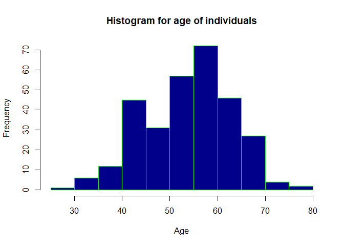

We can see that the distribution is nearly normal. We can now try to see
if the age can be bucketed

<p>
 
</p>

``` r
# Bucketing the population based on age
youngsters <- heart.disease.data[which((heart.disease.data$age < 45)), ]
middleaged <- heart.disease.data[which((heart.disease.data$age >= 45)&(heart.disease.data$age < 60)), ]
eldercitizens <- heart.disease.data[which(heart.disease.data$age > 60), ]
buckets <- data.frame(age.buckets = c("youngsters","middleaged","eldercitizens"), bucket.count = c(NROW(youngsters$age), NROW(middleaged$age), NROW(eldercitizens$age)))

# Creating bar plots for age groups
ggplot(buckets, aes(x=buckets$age.buckets, y=buckets$bucket.count, fill=buckets$age.buckets)) + 
  ggtitle("Bucketing age groups for analysis") +
  xlab("Age Buckets")  +
  ylab("Count") +
  geom_bar(stat="identity") +
  scale_fill_discrete(name = "Age Buckets")
```

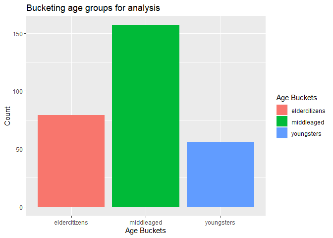

After creating the buckets we can see that the number of people in the
middle bucket are the highest.

Now to get a sense of how the distribution of each variable differs
across the groups with and without heart diseases, we will juxtapose the
two distributions for each variable.

<p>
 
</p>

``` r
library(ggplot2)

# Comparing distribution of age
g <- ggplot(heart.disease.data, aes(age))
g + geom_bar(aes(group=target), fill='grey',color="darkgreen") + facet_wrap(~target) + theme(legend.position = "none") + 
  ggtitle("Distribution of age for heart disease group and non-heart disease group") +
  labs(y="Frequency", x = "Age")
```

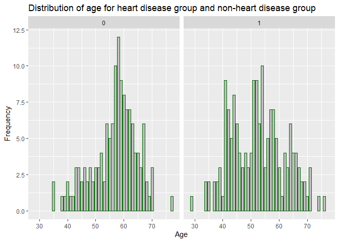

We see that the distribution of age for group with heart diseases is
left-skewed whereas it is multimodal for the group without heart
diseases.

<p>
 
</p>

``` r
# Comparing plots for age
ggplot(data = heart.disease.data, mapping = aes(x = target, y = age, group = target)) + geom_boxplot(fill='grey',color="blue") +
  ggtitle("Age for heart disease group and non-heart disease group") +
  labs(y="Age", x = "Target")
```

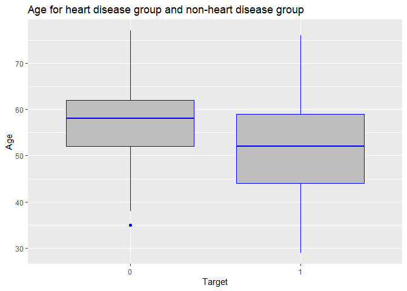

We see that the median age of the group with heart disease is higher
than those without heart diseases.

Now in order to see whether the target is dependent on this feature, we
will perform a t-test.

<p>
 
</p>

``` r
t.out <- t.test(heart.disease.data$age ~ heart.disease.data$target, conf.level = 0.95)
print(t.out)
```

    ## 
    ##  Welch Two Sample t-test
    ## 
    ## data:  heart.disease.data$age by heart.disease.data$target
    ## t = 4.0797, df = 301, p-value = 5.781e-05
    ## alternative hypothesis: true difference in means is not equal to 0
    ## 95 percent confidence interval:
    ##  2.124635 6.084324
    ## sample estimates:
    ## mean in group 0 mean in group 1 
    ##        56.60145        52.49697

Since the t-statistic is greater than 1.96, we can say that the values
of age for target 1 are significantly different from values of age for
target 0. Hence, this feature is significantly important in predicting
the target.

<p>
 
</p>

#### Sex

``` r
# Comparing distribution of gender
library(ggplot2)
g <- ggplot(heart.disease.data, aes(sex))
g + geom_bar(aes(group=target), fill='grey',color="darkgreen") + facet_wrap(~target) + theme(legend.position = "none") + 
  ggtitle("Distribution of gender for heart disease group and non-heart disease group") +
  labs(y="Frequency", x = "Sex")
```

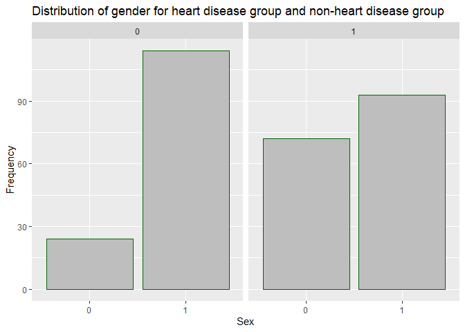

We see that the difference in the number of males and females is higher
for group with heart diseases when compared to the group without heart
diseases.

Now in order to see whether the target is dependent on this feature, we
will perform a chi-square test since these variables are categorical.

<p>
 
</p>

``` r
chisq.test(table(heart.disease.data$sex, heart.disease.data$target), correct = FALSE)
```

    ## 
    ##  Pearson's Chi-squared test
    ## 
    ## data:  table(heart.disease.data$sex, heart.disease.data$target)
    ## X-squared = 23.914, df = 1, p-value = 1.007e-06

Since the p value is greater than 0.05, we do not have sufficient
evidence to reject the null hypothesis that the two variables are
independent. Hence, this feature is not significantly important in
predicting the target.

<p>
 
</p>

#### cp - Chest Pain

``` r
# Comparing distribution of cp
library(ggplot2)
g <- ggplot(heart.disease.data, aes(cp))
g + geom_bar(aes(group=target), fill='grey',color="darkgreen") + facet_wrap(~target) + theme(legend.position = "none") + 
  ggtitle("Distribution of Chest Pain for heart disease group and non-heart disease group") +
  labs(y="Frequency", x = "Chest Pain")
```

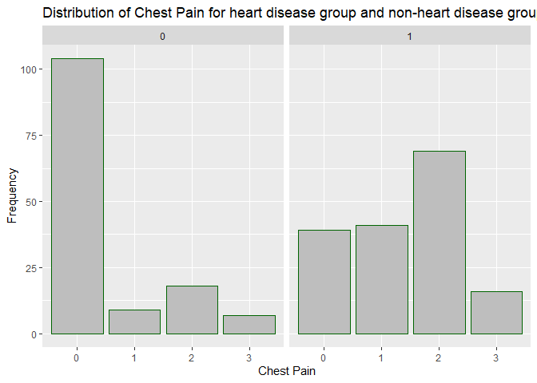

We see that the difference in frequencies across different cp values for
the groups with and without heart diseases is high for values 0, 1 and
2.

Now in order to see whether the target is dependent on this feature, we
will perform a chi-square test since these variables are categorical.

<p>
 
</p>

``` r
chisq.test(table(heart.disease.data$cp, heart.disease.data$target), correct = FALSE)
```

    ## 
    ##  Pearson's Chi-squared test
    ## 
    ## data:  table(heart.disease.data$cp, heart.disease.data$target)
    ## X-squared = 81.686, df = 3, p-value < 2.2e-16

Since the p value is less than 0.05, we have sufficient evidence to
reject the null hypothesis that the two variables are independent.
Hence, this feature is significantly important in predicting the target.

<p>
 
</p>

#### trestbps - Resting Blood Pressure

``` r
# Comparing distribution of trestbps
library(ggplot2)
g <- ggplot(heart.disease.data, aes(trestbps))
g + geom_bar(aes(group=target), fill='grey',color="darkgreen") + facet_wrap(~target) + theme(legend.position = "none") + 
  ggtitle("Distribution of Resting Blood Pressure for heart disease group and non-heart disease group") +
  labs(y="Frequency", x = "Resting Blood Pressure")
```

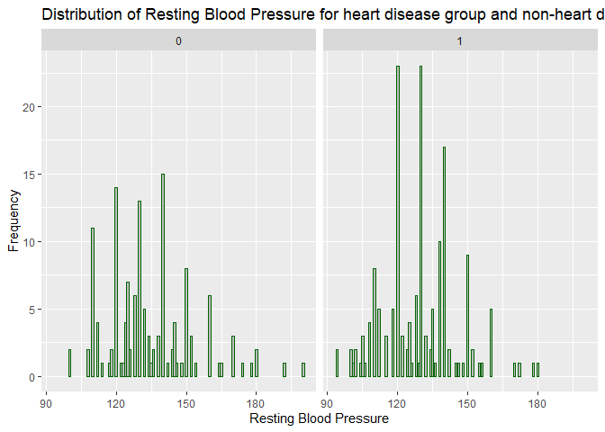

We see that both the distributions are multimodal.

<p>
 
</p>

``` r
# Comparing plots for trestbps
ggplot(data = heart.disease.data, mapping = aes(x = target, y = trestbps, group = target)) + geom_boxplot(fill='grey',color="blue") +
  ggtitle("Resting Blood Pressure for heart disease group and non-heart disease group") +
  labs(y="Resting Blood Pressure", x = "Target")
```

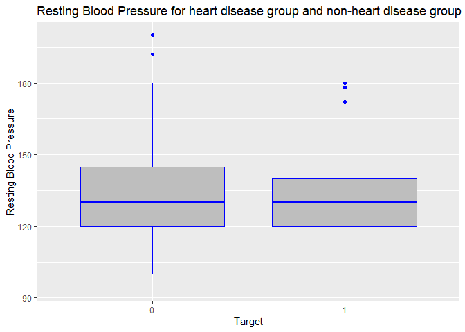

We see that the median for both the groups is nearly equal.

Now in order to see whether the target is dependent on this feature, we
will perform a t-test.

<p>
 
</p>

``` r
t.out <- t.test(heart.disease.data$trestbps ~ heart.disease.data$target, conf.level = 0.95)
print(t.out)
```

    ## 
    ##  Welch Two Sample t-test
    ## 
    ## data:  heart.disease.data$trestbps by heart.disease.data$target
    ## t = 2.5083, df = 272.56, p-value = 0.01271
    ## alternative hypothesis: true difference in means is not equal to 0
    ## 95 percent confidence interval:
    ##  1.096240 9.094801
    ## sample estimates:
    ## mean in group 0 mean in group 1 
    ##        134.3986        129.3030

Since the t-statistic is greater than 1.96, we can say that the values
of trestbps for target 1 are significantly different from values of age
for target 0. Hence, this feature is significantly important in
predicting the target.

<p>
 
</p>

#### chol - Cholesterol

``` r
# Comparing distribution of chol
library(ggplot2)
g <- ggplot(heart.disease.data, aes(chol))
g + geom_bar(aes(group=target), fill='grey',color="darkgreen") + facet_wrap(~target) + theme(legend.position = "none") + 
  ggtitle("Distribution of Cholesterol levels for heart disease group and non-heart disease group") +
  labs(y="Frequency", x = "Cholesterol")
```

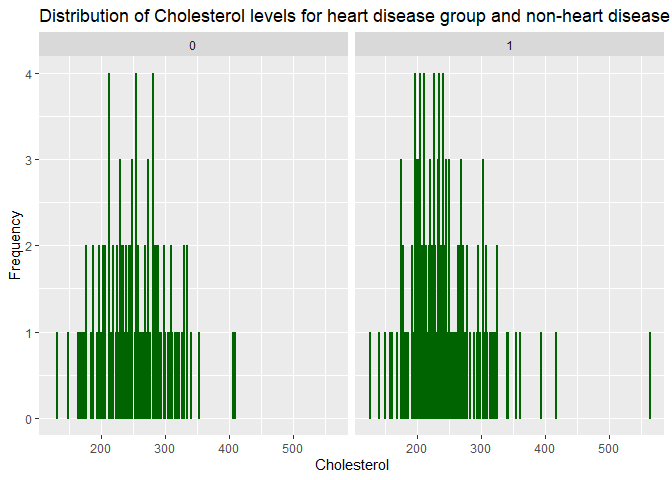

We see that both the distributions are sort of right-skewed.

<p>
 
</p>

``` r
# Comparing plots for chol
ggplot(data = heart.disease.data, mapping = aes(x = target, y = chol, group = target)) + geom_boxplot(fill='grey',color="blue") +
  ggtitle("Cholesterol levels for heart disease group and non-heart disease group") +
  labs(y="Cholesterol", x = "Target")
```

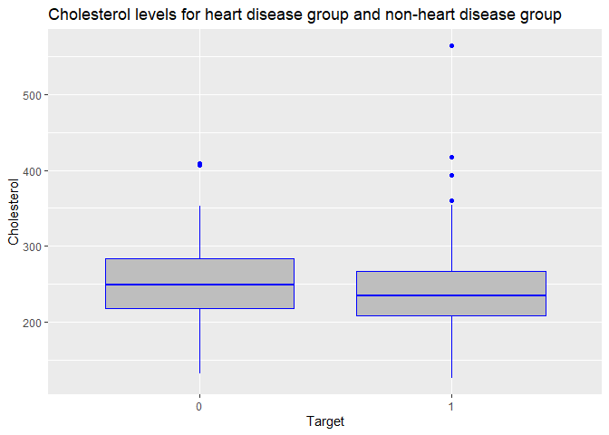

We see that the median for both the groups is nearly equal, the
non-heart disease group being a little lower

Now in order to see whether the target is dependent on this feature, we
will perform a t-test.

<p>
 
</p>

``` r
t.out <- t.test(heart.disease.data$chol ~ heart.disease.data$target, conf.level = 0.95)
print(t.out)
```

    ## 
    ##  Welch Two Sample t-test
    ## 
    ## data:  heart.disease.data$chol by heart.disease.data$target
    ## t = 1.4948, df = 298.03, p-value = 0.136
    ## alternative hypothesis: true difference in means is not equal to 0
    ## 95 percent confidence interval:
    ##  -2.803241 20.516548
    ## sample estimates:
    ## mean in group 0 mean in group 1 
    ##        251.0870        242.2303

Since the t-statistic is less than 1.96, we fail to reject the null
hypothesis. We can say that the values of chol for target 1 are not
significantly different from values of age for target 0. Hence, this
feature is not significantly important in predicting the target.

<p>
 
</p>

#### fbs - Fasting Blood Sugar

``` r
# Comparing distribution of fbs
library(ggplot2)
g <- ggplot(heart.disease.data, aes(fbs))
g + geom_bar(aes(group=target), fill='grey',color="darkgreen") + facet_wrap(~target) + theme(legend.position = "none") + 
  ggtitle("Distribution of Fasting Blood Sugar for heart disease group and non-heart disease group") +
  labs(y="Frequency", x = "Fasting Blood Sugar")
```

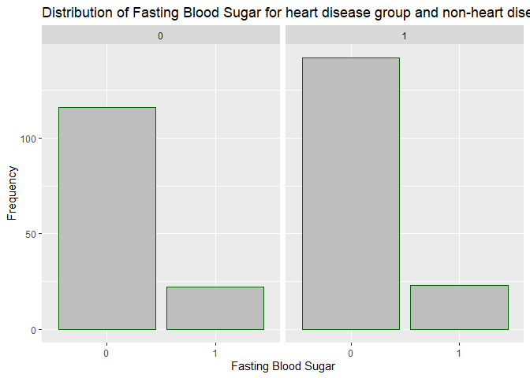

We see that the difference in fbs values for the groups with and without
heart diseases is not much.

Now in order to see whether the target is dependent on this feature, we
will perform a chi-square test since these variables are categorical.

<p>
 
</p>

``` r
chisq.test(table(heart.disease.data$fbs, heart.disease.data$target), correct = FALSE)
```

    ## 
    ##  Pearson's Chi-squared test
    ## 
    ## data:  table(heart.disease.data$fbs, heart.disease.data$target)
    ## X-squared = 0.23833, df = 1, p-value = 0.6254

Since the p value is greater than 0.05, we do not have have sufficient
evidence to reject the null hypothesis that the two variables are
independent. Hence, this feature is not significantly important in
predicting the target.

<p>
 
</p>

#### restecg - Resting Electrocardiographic Measurement

``` r
# Comparing distribution of restecg
library(ggplot2)
g <- ggplot(heart.disease.data, aes(restecg))
g + geom_bar(aes(group=target), fill='grey',color="darkgreen") + facet_wrap(~target) + theme(legend.position = "none") + 
  ggtitle("Distribution of Resting Electrocardiographic Measurement for heart disease group and non-heart disease group") +
  labs(y="Frequency", x = "Resting Electrocardiographic Measurement")
```

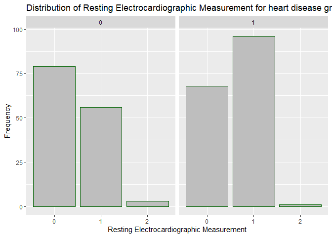

We see that the difference in restecg values for the groups with and
without heart diseases is not much.

Now in order to see whether the target is dependent on this feature, we
will perform a chi-square test since these variables are categorical.

``` r
chisq.test(table(heart.disease.data$restecg, heart.disease.data$target), correct = FALSE)
```

    ## Warning in chisq.test(table(heart.disease.data$restecg,
    ## heart.disease.data$target), : Chi-squared approximation may be incorrect

    ## 
    ##  Pearson's Chi-squared test
    ## 
    ## data:  table(heart.disease.data$restecg, heart.disease.data$target)
    ## X-squared = 10.023, df = 2, p-value = 0.006661

It gave the warning because many of the expected values will be very
small and therefore the approximations of p may not be right. Hence, we
cannot come to a definitive conclusion for this feature.

<p>
 
</p>

#### thalach - Maximum Heart Rate Achieved

``` r
# Comparing distribution of thalach
library(ggplot2)
g <- ggplot(heart.disease.data, aes(thalach))
g + geom_bar(aes(group=target), fill='grey',color="darkgreen") + facet_wrap(~target) + theme(legend.position = "none") + 
  ggtitle("Distribution of Maximum Heart Rate Achieved for heart disease group and non-heart disease group") +
  labs(y="Frequency", x = "Maximum Heart Rate Achieved")
```

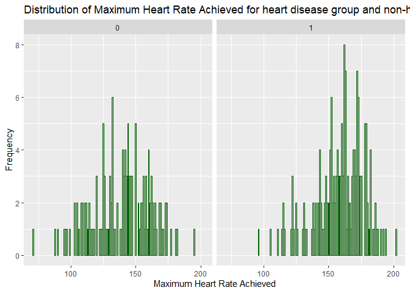

We see that the distribution of thalach is multimodal for both the
groups.

<p>
 
</p>

``` r
# Comparing plots for thalach
ggplot(data = heart.disease.data, mapping = aes(x = target, y = thalach, group = target)) + geom_boxplot(fill='grey',color="blue") +
  ggtitle("Maximum Heart Rate Achieved for heart disease group and non-heart disease group") +
  labs(y="Maximum Heart Rate Achieved", x = "Target")
```

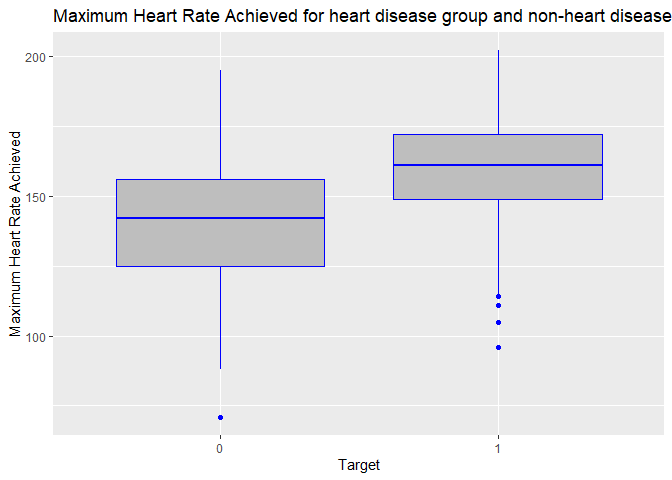

We see that the median for the group without heart diseases is higher.

Now in order to see whether the target is dependent on this feature, we
will perform a t-test.

<p>
 
</p>

``` r
t.out <- t.test(heart.disease.data$thalach ~ heart.disease.data$target, conf.level = 0.95)
print(t.out)
```

    ## 
    ##  Welch Two Sample t-test
    ## 
    ## data:  heart.disease.data$thalach by heart.disease.data$target
    ## t = -7.953, df = 269.9, p-value = 5.019e-14
    ## alternative hypothesis: true difference in means is not equal to 0
    ## 95 percent confidence interval:
    ##  -24.15912 -14.57132
    ## sample estimates:
    ## mean in group 0 mean in group 1 
    ##        139.1014        158.4667

Since the t-statistic is less than -1.96, we can say that the values of
thalach for target 1 are significantly different from values of age for
target 0. Hence, this feature is significantly important in predicting
the target.

<p>
 
</p>

#### exang - Exercise Induced Angina

``` r
# Comparing distribution of exang
library(ggplot2)
g <- ggplot(heart.disease.data, aes(exang))
g + geom_bar(aes(group=target), fill='grey',color="darkgreen") + facet_wrap(~target) + theme(legend.position = "none") + 
  ggtitle("Distribution of Exercise Induced Angina for heart disease group and non-heart disease group") +
  labs(y="Frequency", x = "Exercise Induced Angina")
```

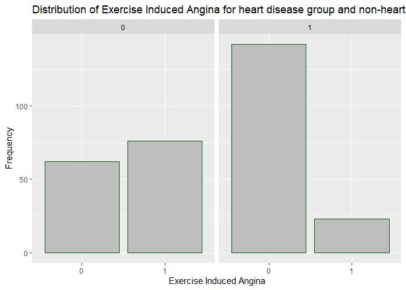

We see that the differences in frequencies corresponding to each of the
values of exang for the groups with and without heart diseases is
different based on the exang value. The difference is higher for value
0.

Now in order to see whether the target is dependent on this feature, we
will perform a chi-square test since these variables are categorical.

<p>
 
</p>

``` r
chisq.test(table(heart.disease.data$exang, heart.disease.data$target), correct = FALSE)
```

    ## 
    ##  Pearson's Chi-squared test
    ## 
    ## data:  table(heart.disease.data$exang, heart.disease.data$target)
    ## X-squared = 57.799, df = 1, p-value = 2.903e-14

Since the p value is greater than 0.05, we do not have sufficient
evidence to reject the null hypothesis that the two variables are
independent. Hence, this feature is not significantly important in
predicting the target.

<p>
 
</p>

#### oldpeak

``` r
# Comparing distribution of oldpeak
library(ggplot2)
g <- ggplot(heart.disease.data, aes(oldpeak))
g + geom_bar(aes(group=target), fill='grey',color="darkgreen") + facet_wrap(~target) + theme(legend.position = "none") + 
  ggtitle("Distribution of oldpeak for heart disease group and non-heart disease group") +
  labs(y="Frequency", x = "oldpeak")
```

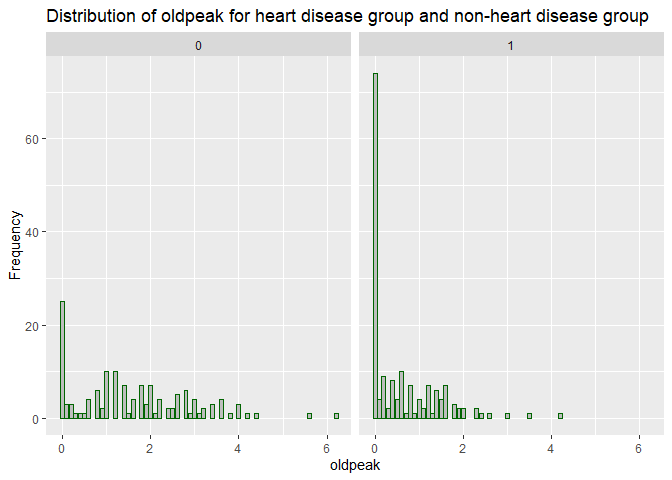

We see that the distribution of oldpeak for both the groups is
multimodal.

<p>
 
</p>

``` r
# Comparing plots for oldpeak
ggplot(data = heart.disease.data, mapping = aes(x = target, y = oldpeak, group = target)) + geom_boxplot(fill='grey',color="blue") +
  ggtitle("oldpeak for heart disease group and non-heart disease group") +
  labs(y="oldpeak", x = "Target")
```

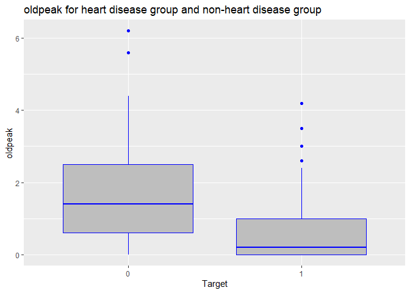

We see that the median for the group with heart disease is higher.

Now in order to see whether the target is dependent on this feature, we
will perform a t-test.

<p>
 
</p>

``` r
t.out <- t.test(heart.disease.data$oldpeak ~ heart.disease.data$target, conf.level = 0.95)
print(t.out)
```

    ## 
    ##  Welch Two Sample t-test
    ## 
    ## data:  heart.disease.data$oldpeak by heart.disease.data$target
    ## t = 7.9386, df = 215.68, p-value = 1.11e-13
    ## alternative hypothesis: true difference in means is not equal to 0
    ## 95 percent confidence interval:
    ##  0.753577 1.251377
    ## sample estimates:
    ## mean in group 0 mean in group 1 
    ##       1.5855072       0.5830303

Since the t-statistic is greater than 1.96, we can say that the values
of trestbps for target 1 are significantly different from values of age
for target 0. Hence, this feature is significantly important in
predicting the target.

<p>
 
</p>

#### slope

``` r
# Comparing distribution of slope
library(ggplot2)
g <- ggplot(heart.disease.data, aes(slope))
g + geom_bar(aes(group=target), fill='grey',color="darkgreen") + facet_wrap(~target) + theme(legend.position = "none") + 
  ggtitle("Distribution of slope for heart disease group and non-heart disease group") +
  labs(y="Frequency", x = "slope")
```

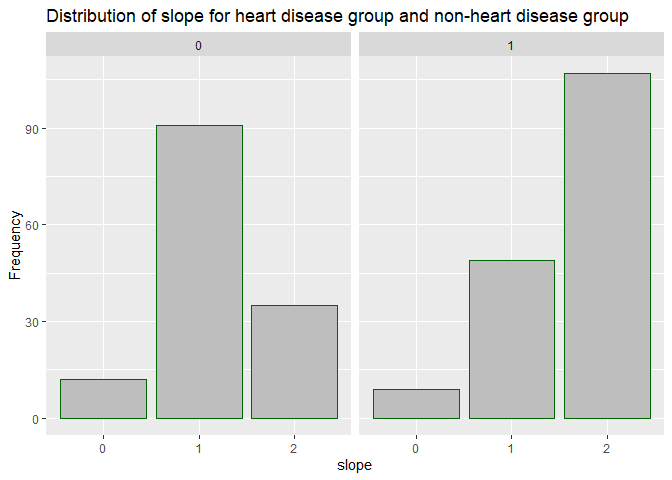

We see that the differences in frequencies corresponding to each of the
values of slope for the groups with and without heart diseases is
different based on the slope value. The differences are higher for
values 1 and 2.

Now in order to see whether the target is dependent on this feature, we
will perform a chi-square test since these variables are categorical.

<p>
 
</p>

``` r
chisq.test(table(heart.disease.data$slope, heart.disease.data$target), correct = FALSE)
```

    ## 
    ##  Pearson's Chi-squared test
    ## 
    ## data:  table(heart.disease.data$slope, heart.disease.data$target)
    ## X-squared = 47.507, df = 2, p-value = 4.831e-11

Since the p value is greater than 0.05, hence we do not have have
sufficient evidence to reject the null hypothesis that the two variables
are independent. Hence, this feature is not significantly important in
predicting the target.

<p>
 
</p>

#### ca - Number of Major Vessels

``` r
# Comparing distribution of ca
library(ggplot2)
g <- ggplot(heart.disease.data, aes(ca))
g + geom_bar(aes(group=target), fill='grey',color="darkgreen") + facet_wrap(~target) + theme(legend.position = "none") + 
  ggtitle("Distribution of Number of Major Vessels for heart disease group and non-heart disease group") +
  labs(y="Frequency", x = "Number of Major Vessels")
```

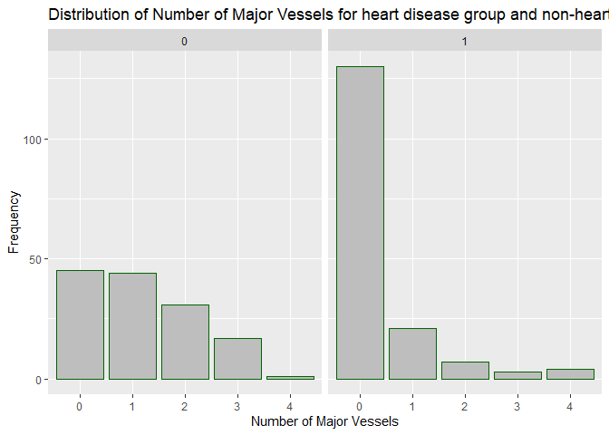

We see that the differences in frequencies corresponding to each of the
values of ca for the groups with and without heart diseases is different
based on the ca value. The difference is higher for value 1.

Now in order to see whether the target is dependent on this feature, we
will perform a chi-square test since these variables are categorical.

<p>
 
</p>

``` r
chisq.test(table(heart.disease.data$ca, heart.disease.data$target), correct = FALSE)
```

    ## Warning in chisq.test(table(heart.disease.data$ca,
    ## heart.disease.data$target), : Chi-squared approximation may be incorrect

    ## 
    ##  Pearson's Chi-squared test
    ## 
    ## data:  table(heart.disease.data$ca, heart.disease.data$target)
    ## X-squared = 74.367, df = 4, p-value = 2.712e-15

It gave the warning because many of the expected values will be very
small and therefore the approximations of p may not be right. Hence, we
cannot come to a definitive conclusion for this feature.

<p>
 
</p>

#### thal - Thalassemia

``` r
# Comparing distribution of thal
library(ggplot2)
g <- ggplot(heart.disease.data, aes(thal))
g + geom_bar(aes(group=target), fill='grey',color="darkgreen") + facet_wrap(~target) + theme(legend.position = "none") + 
  ggtitle("Distribution of Thalassemia for heart disease group and non-heart disease group") +
  labs(y="Frequency", x = "Thalassemia")
```

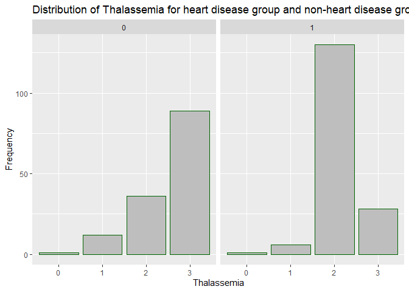

We see that the differences in frequencies corresponding to each of the
values of thal for the groups with and without heart diseases is
different based on the thal value. The differences are higher for values
2 and 3.

Now in order to see whether the target is dependent on this feature, we
will perform a chi-square test since these variables are categorical.

<p>
 
</p>

``` r
chisq.test(table(heart.disease.data$thal, heart.disease.data$target), correct = FALSE)
```

    ## Warning in chisq.test(table(heart.disease.data$thal,
    ## heart.disease.data$target), : Chi-squared approximation may be incorrect

    ## 
    ##  Pearson's Chi-squared test
    ## 
    ## data:  table(heart.disease.data$thal, heart.disease.data$target)
    ## X-squared = 85.304, df = 3, p-value < 2.2e-16

It gave the warning because many of the expected values will be very
small and therefore the approximations of p may not be right. Hence, we
cannot come to a definitive conclusion for this feature.

<p>
 
</p>

### Significant factors based on hypothesis testing

After ruling out the factors which did not come out to be significant
based of hypothesis testing, we are left with age, cp, trestbps,
thalach, oldpeak, restecg, ca and thal.

Note that we are only removing the ones where were proved to be not
significant.

<p>
 
</p>

### Looking at correlations

We will now look at the correlation matrix to determine the correlations
between the variables. Note that we will look at the numeric variables
only.

``` r
library(corrplot)
```

    ## corrplot 0.84 loaded

``` r
numeric.variables <- unlist(lapply(heart.disease.data, is.numeric))  
heart.disease.data.numeric <- heart.disease.data[ , numeric.variables]

corrdata <- cor(heart.disease.data.numeric)
print(corrdata)
```

    ##                 age    trestbps         chol      thalach     oldpeak
    ## age       1.0000000  0.27935091  0.213677957 -0.398521938  0.21001257
    ## trestbps  0.2793509  1.00000000  0.123174207 -0.046697728  0.19321647
    ## chol      0.2136780  0.12317421  1.000000000 -0.009939839  0.05395192
    ## thalach  -0.3985219 -0.04669773 -0.009939839  1.000000000 -0.34418695
    ## oldpeak   0.2100126  0.19321647  0.053951920 -0.344186948  1.00000000

``` r
corrplot(corrdata)
```

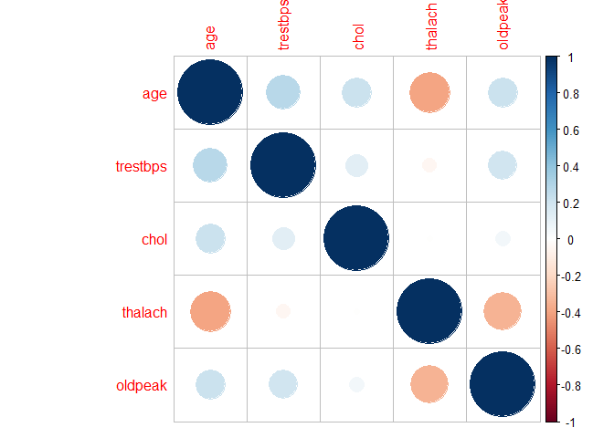

We see that the highest correlation value is 0.4 which is not strong
enough. Hence, we will not remove any of the significant variables based
on multicollinearity.

<p>
 
</p>

Building the classification model
---------------------------------

### Check for class imbalance

Class Imbalance means that the number of data points available for the
different classes is different. If there are two classes, then balanced
data would mean nearly 50% points for each of the class. For most
machine learning techniques, little imbalance is not a problem. So, if
there are 60% points for one class and 40% for the other class, it
should not cause any significant performance degradation.

``` r
# Bar plot for target (Heart disease) 
ggplot(heart.disease.data, aes(x=heart.disease.data$target, fill = heart.disease.data$target)) + 
  geom_bar() +
  xlab("Target") +
  ylab("Frequency") +
  ggtitle("Comparing data points for the classes") +
  scale_fill_discrete(name = "Heart Disease", labels = c("Group without heart disease", "Group with heart disease"))
```

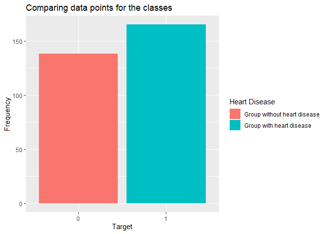

``` r
# Getting the raw numbers
table(heart.disease.data$target) 
```

    ## 
    ##   0   1 
    ## 138 165

The difference in the number of data points for the two classes is
19.56%, which is acceptable and so there is no need to balance the
classes.

<p>
 
</p>

### Creating the train test split

We are divided the entire dataset into two groups, one for training the
model and the other for testing the model.

``` r
library(caret)
```

    ## Loading required package: lattice

``` r
set.seed(1120)
#partition the data into a 70%/30% training/testing split
inTrain <- createDataPartition(y = heart.disease.data$target,
                               p = .7,
                               list = FALSE)
training <- heart.disease.data[inTrain, ] # training dataframe
testing <- heart.disease.data[-inTrain, ] # testing dataframe
```

createDataPartition does a stratified random split of the data, hence we
do not need to shuffle the data.

We will now use trainConrol() to determine the resampling method.

<p>
 
</p>

### Building the base classification model using all the features

We will first create a base model using all the features in the data.
This will be used as a reference against the improved model which will
only have the significant features that we had arrived upon using
hypothesis testing.

<p>
 
</p>

#### Boosted Logistic Regression - base model with all features

This model contains all the features.

``` r
# Define train control parameters
ctrl <- trainControl(method="repeatedcv", 
                     repeats=10)

# Define parameters to be used for lr model
blrFit <- train(target ~ .,
                data=training,
                method="LogitBoost",
                trControl=ctrl)

# Using the trained model to predict on test data
blrClasses <- predict(blrFit, newdata = testing)

# Performance measurement
postResample(blrClasses, testing$target)
```

    ##  Accuracy     Kappa 
    ## 0.8222222 0.6472317

``` r
# Confusion matrix
cmblr <-confusionMatrix(blrClasses, testing$target)
print(cmblr)
```

    ## Confusion Matrix and Statistics
    ## 
    ##           Reference
    ## Prediction  0  1
    ##          0 37 12
    ##          1  4 37
    ##                                           
    ##                Accuracy : 0.8222          
    ##                  95% CI : (0.7274, 0.8948)
    ##     No Information Rate : 0.5444          
    ##     P-Value [Acc > NIR] : 2.84e-08        
    ##                                           
    ##                   Kappa : 0.6472          
    ##                                           
    ##  Mcnemar's Test P-Value : 0.08012         
    ##                                           
    ##             Sensitivity : 0.9024          
    ##             Specificity : 0.7551          
    ##          Pos Pred Value : 0.7551          
    ##          Neg Pred Value : 0.9024          
    ##              Prevalence : 0.4556          
    ##          Detection Rate : 0.4111          
    ##    Detection Prevalence : 0.5444          
    ##       Balanced Accuracy : 0.8288          
    ##                                           
    ##        'Positive' Class : 0               
    ## 

We see that the accuracy of this base model is 82.22 % Kappa is 64.72 %

<p>
 
</p>

#### Boosted Logistic Regression - Improved model with only the significant features

This model contains only the significant features.

``` r
#define parameters to be used for lr model
blrFit <- train(target ~ age + cp + trestbps + thalach + oldpeak + restecg + ca + thal,
                data=training,
                method="LogitBoost",
                trControl=ctrl)

# Using the trained model to predict on test data
blrClasses <- predict(blrFit, newdata = testing)

# Performance measurement
postResample(blrClasses, testing$target)
```

    ##  Accuracy     Kappa 
    ## 0.8555556 0.7093890

``` r
# Confusion matrix
cmblr <-confusionMatrix(blrClasses, testing$target)
print(cmblr)
```

    ## Confusion Matrix and Statistics
    ## 
    ##           Reference
    ## Prediction  0  1
    ##          0 35  7
    ##          1  6 42
    ##                                           
    ##                Accuracy : 0.8556          
    ##                  95% CI : (0.7657, 0.9208)
    ##     No Information Rate : 0.5444          
    ##     P-Value [Acc > NIR] : 3.463e-10       
    ##                                           
    ##                   Kappa : 0.7094          
    ##                                           
    ##  Mcnemar's Test P-Value : 1               
    ##                                           
    ##             Sensitivity : 0.8537          
    ##             Specificity : 0.8571          
    ##          Pos Pred Value : 0.8333          
    ##          Neg Pred Value : 0.8750          
    ##              Prevalence : 0.4556          
    ##          Detection Rate : 0.3889          
    ##    Detection Prevalence : 0.4667          
    ##       Balanced Accuracy : 0.8554          
    ##                                           
    ##        'Positive' Class : 0               
    ## 

We see that the accuracy of this base model is 85.56 % Kappa is 70.94 %

Hence, we are getting a better performing model when train the model
only on the significant features. Training on lesser number of features
also makes the compuation faster and less resource intensive, which in
turn creates better model scaling outlook.

<p>
 
</p>

### Conclusions

In this analysis, we identified the major factors associated with heart
diseases. The identified factors are age, chest pain, resting bloos
pressure, maximum heart rate achieved, oldpeak, resting
electrocardiographic measurement, number of major vessels and
thalassemia.

We also created a predictive model using Boosted Logistic Regression
which has a test accuracy of 85.56 %. This model was based on the
selected features and it outperformed the base model which was trained
on all the features.

<p>
 
</p>

### References

-   Heart Disease
    -   <a href="https://www.mayoclinic.org/diseases-conditions/heart-disease/symptoms-causes/syc-20353118" class="uri">https://www.mayoclinic.org/diseases-conditions/heart-disease/symptoms-causes/syc-20353118</a>
-   Facts about heart diseases
    -   <a href="https://www.cdc.gov/heartdisease/facts.htm" class="uri">https://www.cdc.gov/heartdisease/facts.htm</a>
    -   <a href="https://www.acc.org/latest-in-cardiology/ten-points-to-remember/2019/02/15/14/39/aha-2019-heart-disease-and-stroke-statistics" class="uri">https://www.acc.org/latest-in-cardiology/ten-points-to-remember/2019/02/15/14/39/aha-2019-heart-disease-and-stroke-statistics</a>
